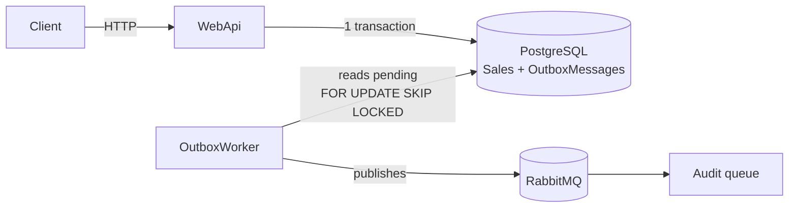

# Developer Evaluation — Sales API

This is my implementation of the DeveloperStore challenge: a .NET 8 REST API for recording sales. It provides full CRUD for sales and items, quantity-based discount rules, cancellations, and publishing of sale events to RabbitMQ through a *transactional outbox*.

The original challenge statement is in [.doc/challenge.md](.doc/challenge.md).

## Contents

- [Developer Evaluation — Sales API](#developer-evaluation--sales-api)
  - [Contents](#contents)
  - [Overview](#overview)
  - [Architecture](#architecture)
  - [Template fixes](#template-fixes)
  - [Implementation](#implementation)
    - [Business rules](#business-rules)
    - [Endpoints](#endpoints)
    - [Published events](#published-events)
  - [Query helper](#query-helper)
  - [Outbox pattern](#outbox-pattern)
  - [Concurrency](#concurrency)
  - [Running the project](#running-the-project)
    - [Prerequisites](#prerequisites)
    - [Step by step](#step-by-step)
    - [Services and ports](#services-and-ports)
  - [Events (extra)](#events-extra)
  - [Tests](#tests)

## Overview

| | |
| --- | --- |
| Runtime | .NET 8 / ASP.NET Core |
| Persistence | PostgreSQL 13 + EF Core 8 (Npgsql) |
| Application | MediatR (CQRS), FluentValidation, AutoMapper |
| Messaging | Rebus + RabbitMQ 4 |
| Authentication | JWT (bearer) |
| Tests | xUnit, NSubstitute, Bogus, FluentAssertions |
| Local infra | Docker Compose |

The sale follows the *External Identities* pattern: customer, branch and product belong to other domains, so the sale stores only their id and a denormalized copy of their name.

## Architecture

```text
template/backend/src
├── Domain        Sale/SaleItem aggregate, discount policy, domain exceptions, repository contracts
├── Application   Commands/queries (MediatR), validation, integration events, outbox recording
├── ORM           DbContext, mappings, migrations, repositories, outbox table
├── Messaging     Outbox dispatch job and Rebus/RabbitMQ configuration
├── IoC           WebApi dependency registration
├── WebApi        Controllers, error middleware, authentication, Swagger
└── OutboxWorker  Separate host that runs the outbox dispatch
```

Flow of a write down to the broker:



The API never talks to the broker: it only stores the sale and the event in the same transaction. Publishing is done by the `OutboxWorker`, a separate process.

## Template fixes

Before starting on sales, my first step was to review the template I received. I fixed inconsistencies and bugs that would have affected everything built on top of it:

- **Secrets and configuration:** I removed passwords and keys from versioned files. They now live in `.env` and `appsettings.Development.json`, and only the `*.example` files are versioned. I also trimmed `docker-compose.yml` and pinned `dotnet-ef` as a local tool.
- **Missing migration:** the `User` date fields existed in the model but had no migration. I added it.
- **Logging:** the Serilog filter was dropping warnings and errors. I fixed the filter.
- **Startup and DI:**
  - I removed duplicated registrations (controllers, health checks, JWT).
  - I removed the design-time factory, which pointed at the wrong migrations assembly.
  - I centralized error handling in a single middleware: validation and domain errors become 400, missing resources 404, invalid credentials 401, and everything else 500. All responses share the same shape.
- **Users:**
  - I merged the duplicated validation into the MediatR pipeline.
  - I fixed responses that came double-wrapped and the empty `Location` header on `POST`.
  - I added a missing mapping.
  - A duplicate e-mail now returns 400 instead of 500.
- **Auth:** invalid credentials now return 401.
- **Security:** the user routes were open. I now require JWT on them, except for user creation, and configured the bearer scheme in Swagger.
- **Entity self-validation:** I removed `BaseEntity.ValidateAsync`. It tried to instantiate an interface and failed every time it was called. Validation now lives in two places: the pipeline, for input, and the aggregate, for invariants.
- **CI:** I added a workflow that builds and runs the tests on every PR.

## Implementation

### Business rules

The rules live inside the `Sale` aggregate and the [`QuantityDiscountPolicy`](template/backend/src/Ambev.DeveloperEvaluation.Domain/Policies/QuantityDiscountPolicy.cs):

| Quantity of identical items | Discount |
| --- | --- |
| 1 to 3 | 0% |
| 4 to 9 | 10% |
| 10 to 20 | 20% |
| above 20 | not allowed (400) |

- Adding a product that is already in the sale **consolidates** the line: the given quantity is added to the current one, and the discount is recalculated on the total. Sending the same product with a different unit price is rejected.
- Adjusting an item's quantity is **relative** (a delta), not absolute. This way the client does not need to know the current quantity, and concurrent adjustments add up instead of overwriting each other.
- An adjustment that would leave the quantity at zero or below is rejected. To remove the item, cancel it.
- Discount and totals are stored on the item as a *snapshot*, so a future change to the rule does not alter past sales.
- A cancelled item stays in the sale for history, but no longer counts towards the total. A cancelled sale accepts no further changes.
- `SaleNumber` is a Postgres *identity* column, generated by the database.

### Endpoints

All sales and user routes require a JWT token, except those marked as public. With `ASPNETCORE_ENVIRONMENT=Development`, Swagger is available at `http://localhost:8080/swagger`.

| Method | Route | Description |
| --- | --- | --- |
| POST | `/api/auth` | Authenticates and returns the token (public) |
| POST | `/api/users` | Creates a user (public) |
| GET | `/api/users/{id}` | Gets a user |
| DELETE | `/api/users/{id}` | Deletes a user |
| POST | `/api/sales` | Creates a sale with items |
| GET | `/api/sales` | Lists sales (pagination, filtering and sorting) |
| GET | `/api/sales/{id}` | Gets a sale |
| PUT | `/api/sales/{id}` | Updates date, customer and branch |
| DELETE | `/api/sales/{id}` | Deletes a sale |
| POST | `/api/sales/{id}/cancel` | Cancels the sale |
| POST | `/api/sales/{id}/items` | Adds an item (consolidates if the product is already there) |
| PATCH | `/api/sales/{id}/items/{itemId}/quantity` | Adjusts the quantity by a delta (`{ "delta": -2 }`) |
| POST | `/api/sales/{id}/items/{itemId}/cancel` | Cancels an item |

Listing follows the conventions in [.doc/general-api.md](.doc/general-api.md): `_page`, `_size`, `_order` (`"saleDate desc, saleNumber"`), per-field filters with `*` for *contains/starts/ends with*, and `_min`/`_max` for ranges. Details are in [Query helper](#query-helper).

Health checks: `/health`, `/health/live` and `/health/ready`.

### Published events

| Event | When | Content |
| --- | --- | --- |
| `SaleCreatedIntegrationEvent` | sale created | full snapshot of the sale and its items |
| `SaleModifiedIntegrationEvent` | update, item added, quantity adjusted | full snapshot of the sale and its items |
| `SaleCancelledIntegrationEvent` | sale cancelled | id, number, cancellation date, total |
| `SaleItemCancelledIntegrationEvent` | item cancelled | sale, item, product, quantity, new sale total |

Every event carries `EventId` and `OccurredAt`. The `EventId` is also sent in the message's `rbs2-msg-id` header, so consumers can discard duplicate deliveries.

## Query helper

The listing has no `if` per filter. I wrote a generic helper that turns the query string into a LINQ expression, which EF Core translates into a single SQL query. It has three parts:

- [`QueryOptionsParser`](template/backend/src/Ambev.DeveloperEvaluation.WebApi/Common/Querying/QueryOptionsParser.cs) (WebApi): reads the query string and returns `QueryOptions` with page, filters and sorting. These types live in the domain and depend on neither HTTP nor EF.
- [`FieldMap<T>`](template/backend/src/Ambev.DeveloperEvaluation.ORM/Querying/FieldMap.cs) (ORM): the *whitelist* that maps the API field name to the entity property. Exposing a new field takes one line in [`SaleFieldMap`](template/backend/src/Ambev.DeveloperEvaluation.ORM/Querying/FieldMaps/SaleFieldMap.cs).
- [`QueryableExtensions`](template/backend/src/Ambev.DeveloperEvaluation.ORM/Querying/QueryableExtensions.cs) (ORM): `ApplyFiltering`, `ApplySorting` and `ApplyPagination` over any `IQueryable<T>`.

```http
GET /api/sales?customerName=*silva*&_minTotalAmount=100&isCancelled=false&_order="saleDate desc"&_page=2&_size=20
```

| Syntax | Operator | SQL |
| --- | --- | --- |
| `field=value` | equals | `=` |
| `field!=value` | not equals | `<>` |
| `field=*value*`, `value*`, `*value` | contains, starts with, ends with | `ILIKE` |
| `_minField=value`, `_maxField=value` | range | `>=`, `<=` |
| `_order="field desc, other"` | sorting | `ORDER BY` |

What it guarantees:

- **Allowed fields only:** a field outside the `FieldMap`, an incompatible operator or an invalid value returns 400.
- **No SQL injection:** values are sent as parameters, and `%`/`_` are escaped in `ILIKE`.
- **Predictable combination:** different fields are combined with `AND`. On the same field, `=` and `*` are combined with `OR` (`?branchName=*north*&branchName=*south*`), while `!=` and ranges are combined with `AND`.
- **Stable pagination:** `saleNumber` is always the last sort key, so tied rows never jump between pages.

To use it with another entity, just create a `FieldMap` for it.

## Outbox pattern

The challenge accepted simply logging the events. I chose to actually publish them, with a consistency guarantee.

**Problem:** saving the sale to the database and publishing to the broker are two separate operations.

- If the broker goes down after the commit, the event is lost.
- If the publish succeeds and the commit fails, an event goes out for something that does not exist.

**Solution:** the handler stores the sale and the event (`OutboxMessages` table) **in the same transaction**, so either both exist or neither does. The `OutboxWorker` then reads the pending messages and publishes them.

What the worker ([`OutboxDispatchJob`](template/backend/src/Ambev.DeveloperEvaluation.Messaging/Outbox/OutboxDispatchJob.cs)) guarantees:

- **No event is lost:** if the broker is down, the message stays pending and is published once it is back.
- **Ordering:** events go out in the order they were stored. If a message fails, the following ones wait, so no event overtakes another.
- **No double publishing across instances:** several workers can run, because each message is locked by a single instance (`FOR UPDATE SKIP LOCKED`).
- **Consumer-side deduplication:** delivery is *at-least-once*. If the worker crashes between publishing and saving, the message goes out again. That is why the `EventId` is used as the message id, so the consumer can discard the duplicate.
- **A broken message does not block the queue forever:** a payload that cannot be deserialized is taken out of the flow after `MaxAttempts` attempts and stays in the table, with the error, for analysis.

The options live in the `Messaging` section of the [worker appsettings](template/backend/src/Ambev.DeveloperEvaluation.OutboxWorker/appsettings.json).

## Concurrency

Two requests may change the same sale at the same time. This is how I handled it:

- **Optimistic concurrency** using Postgres' `xmin` system column as the *row version*. If the sale changed between read and write, EF detects it and the operation fails with `ConcurrencyConflictException`.
- **Relative operations** (adding an item, adjusting quantity by a delta) are **retried on the server**, up to 3 times ([`ConcurrencyRetry`](template/backend/src/Ambev.DeveloperEvaluation.Application/Sales/Common/ConcurrencyRetry.cs)).
  - Re-applying "+2 units" on top of the newer state keeps both changes.
  - That is why I made the quantity adjustment take a **delta** rather than the final value.
- **Absolute operations** (update, cancel sale, cancel item) are **not** retried, because retrying would overwrite the other client's change. The API returns **409 Conflict**, and the client reloads the sale and decides whether to try again.
- Every change returns the full, updated sale, so the client always ends up with the latest version.

## Running the project

### Prerequisites

- Docker with Docker Compose v2
- .NET 8 SDK, only to run the tests

### Step by step

Run every command from `template/backend`.

```bash
cd template/backend

# 1. Configure the variables (the example values already work locally)
cp .env.example .env

# 2. Start the database and apply the migrations
docker compose up -d ambev.developerevaluation.database
docker compose --profile migrate run --rm migrate

# 3. Start everything else
docker compose up -d --build
```

> [!WARNING]
> The values in `.env.example` are fine for this evaluation scenario, but must be changed in production.

> [!NOTE]
> I chose not to apply migrations automatically on startup, to keep control over what changes in the database.
> To apply the migrations, use `docker compose --profile migrate run --rm migrate`.

### Services and ports

| Service | Address | `.env` variable |
| --- | --- | --- |
| WebApi | <http://localhost:8080> (Swagger at `/swagger`) | — |
| PostgreSQL | localhost:5432 | `POSTGRES_HOST_PORT` |
| RabbitMQ (AMQP) | localhost:5672 | `RABBITMQ_HOST_PORT` |
| RabbitMQ (dashboard) | <http://localhost:15672> | `RABBITMQ_MANAGEMENT_PORT` |
| OutboxWorker | no port | — |

## Events (extra)

The RabbitMQ container provides a dashboard at **<http://localhost:15672>** (user `developer`, password `local-dev-password`, as in `.env.example`) to inspect the published events. Every event is also sent to the audit queue **`developer-evaluation.audit`**: open that queue and use **Get messages**.

In the database, the `OutboxMessages` table shows the state of each message: `ProcessedAt` (published), `Attempts` and `LastError` (failures).

## Tests

There are 146 unit tests, all passing, in the `Ambev.DeveloperEvaluation.Unit` project. The `Integration` and `Functional` projects came with the template and are still empty. CI ([.github/workflows/pr-validation.yml](.github/workflows/pr-validation.yml)) runs the suite on every PR and push to `develop` and `main`.

The unit tests cover the business rules and the pieces I built:

| Class | Lines |
| --- | --- |
| `Sale` / `SaleItem` | 97.6% |
| `QuantityDiscountPolicy` | 100% |
| `QueryOptionsParser` / `FieldMap` | 100% |
| `QueryableExtensions` | 94.3% |
| `OutboxDispatchJob` | 100% |
| `ConcurrencyRetry` | 100% |

Coverage per project, generated with the template's `coverage-report`:

| Project | Lines | Branches |
| --- | --- | --- |
| Domain | 87.6% | 82.7% |
| Application | 68.3% | 64.3% |
| ORM | 68.5% | 63.2% |
| Messaging | 55.1% | 57.1% |
| WebApi | 13.4% | 58.8% |
| **Total** | **50.6%** | **59.8%** |

> [!NOTE]
> The template's coverage scripts needed small fixes to apply the exclusion filters correctly, which keep migrations and `Program` out of the metrics.
